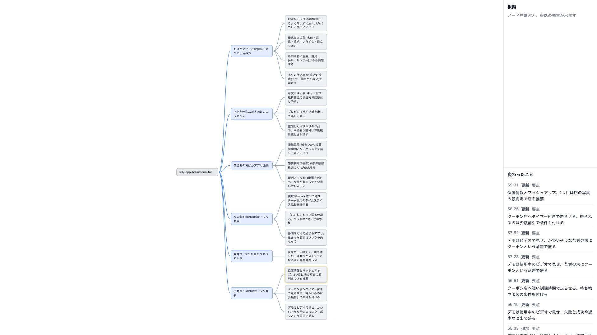
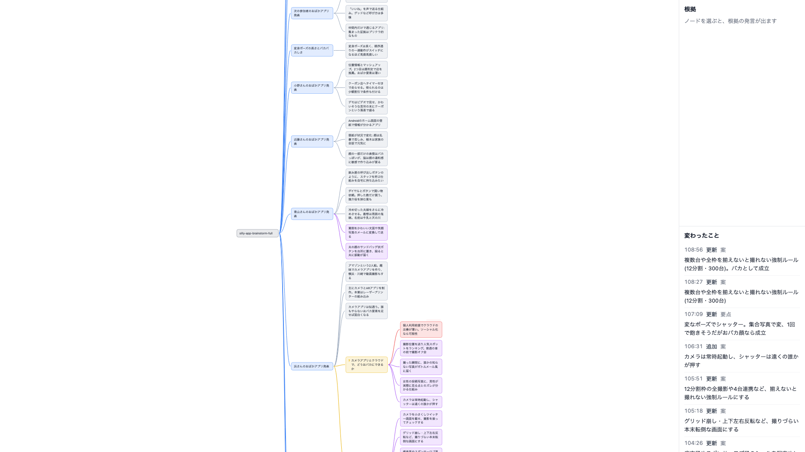
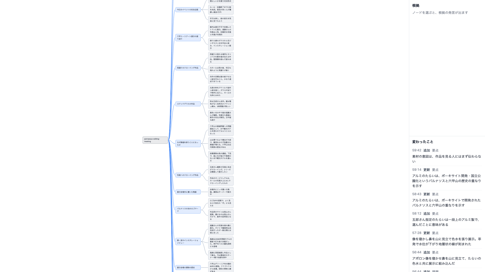
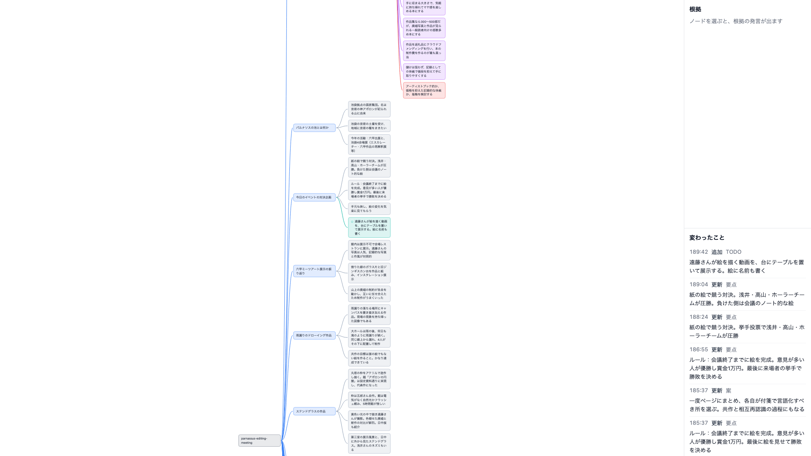

# 長い会議を今の作りのまま流したときの計測（Issue #127）

親の地図: [長い会議（60 分超・上限なし）への対応](https://github.com/daiki-beppu/live-mindmap/issues/126)。60 分を超える公開会議 2 本（110 分・191 分）を、今の作り（`main` の 100f613。プロダクションコードは変えていない）のまま最後まで流し、10 分ごとに費用・入力・応答時間・マップの形を測った。60・90・120 分以降のマップは、今のライブの画面で 1920×1080 で撮った。結論は次のとおり。

- **応答時間は伸びなかった。** 1 回の呼び出しの p50 は 2〜4 秒、p90 は 4〜6 秒で、191 分の終わりまで変わらない。
- **1 回の費用はノード数にほぼ比例して伸び、累計は時間の 2 乗に近い形で伸びる。** 191 分の会議では、1 回の費用が $0.011（0〜10 分）から $0.043（180〜190 分）の 4 倍になった。1 時間ごとの費用は $1.48 → $2.39 → $4.37（最後の 70 分）で、合計は $8.24 になった。110 分の会議は $2.48。
- **費用の伸びのほとんどは、毎回送るアウトラインから来る。** 180 分以降、今回送るプロンプトの 86% がアウトラインで、1 回の費用の約 6 割をアウトラインの書き込みが占めた。191 分の会議全体では、アウトラインに $5.4（費用の 65%）を使った。「変更分だけ送る」案（#75）は、長い会議で測り直す価値がある。
- **画面は 45 ノード前後で全体を収められなくなる。** ライブの画面は React Flow の既定の最小倍率 0.5 で止まり、それより大きいマップは上下がはみ出す。はみ出した側に今の議題が入ることもある。191 分の会議は 60 分の時点で 58 ノード中 24 が画面の外、終わりには 151 ノード中 123 が画面の外だった。倍率 0.5 の文字は 7px で、共有先で縮小されると読めない。
- **後半の話題は新しい議題にならず、序盤のノードの下に積み上がった。** 191 分の会議の後半（約 100 分以降）は記録集の作り方を詰める議論だったが、AI は新しい議題を立てず、1 分目に立てた論点の下に案と課題を 30 個並べた。プロンプトには「1 つの親の下に 6 つを超えそうなら、論点を立てて move で束ねる」とあるが、move は 2 本の会議を通して 1 回、combine は 0 回だった。60 分以内でも、110 分の会議では 16〜43 分の約 27 分（複数の発表者）を 1 つの要点（根拠 71 発言）にまとめていた。

## 素材

素材はすべて `~/live-mindmap-samples/` に置き、git には入れていない（第三者の著作物）。一覧と作り方は同じフォルダの `README.md` の表に追記した。

| ファイル | 出典 | 長さ | 性質 | 流したか |
| --- | --- | --- | --- | --- |
| `silly-app-brainstorm-full.*` | [おばかアプリブレスト会議 後編](https://www.youtube.com/watch?v=ogtvHpmuYiU)（@IT） | 110 分（全編） | 発散型。1 人ずつアプリ案を発表し周りが突っ込む | 流した |
| `parnassus-editing-meeting.*` | [公開編集会議！『パルナソスの池《山々を泳ぐ方舟》記録集』](https://www.youtube.com/watch?v=nhV8yM69Wy0)（honkbooksコ本や） | 191 分（元動画 197 分から、冒頭 6 分 22 秒の無音を除く） | 共有から収束へ移る。前半は展示の振り返り（写真ごとの体験談）。82〜89 分に休憩（無音）。後半は記録集の形・部数・進め方を詰め、「今日はまとまらず」で終わる | 流した |
| `igoku-editing-meeting.*` | [『igoku本』第２回 公開編集会議](https://www.youtube.com/watch?v=VFgdrYm81xM) | 122 分（全編） | 収束型。本の章立てや座談会の要否を決める | 素材だけ（費用を抑えるため流していない） |

- 取得: `uvx yt-dlp --js-runtimes node --remote-components ejs:github -f bestaudio`（`--remote-components` が無いと、parnassus は `This video is not available` で落ちた）。
- 文字起こし: Kanary は 1 ファイル 75 分を超えると Pro が要る。ffmpeg で 75 分未満に分け、`kanary transcribe <m4a> --lang ja --out <json>` で文字起こしし、時刻をずらして `.transcript.segments[]` の形のままつないだ。silly は既存の先頭 60 分のファイルに、3600 秒以降を足した。parnassus は 1 秒以上の無音の位置（元動画の 4374 秒・8179 秒）で 3 つに分けた。silly の 3600 秒のつなぎ目は無音の位置ではないので、発言が 2 つに切れている可能性がある。
- 2〜3 時間の会議の探し方: YouTube を yt-dlp の `ytsearch25:` で、「公開会議 ノーカット」「公開定例会議」「ブレスト会議 生配信」「運営会議 公開」「公開 経営会議」「企画会議 生配信」「公開編集会議」など 19 語で検索し、100 分以上のものを候補にした。国会・市議会・討論会は質疑と答弁が中心で、会議の進め方が違う。配信者の企画会議は 1 人で話す雑談が中心だった。参加者が複数いて何かを決めようとする会議は、公開編集会議の 2 本だけだった。これらは 1 分ずつ 5〜8 カ所で試し起こしし、中身を確かめてから選んだ。

## 測り方

- 再生: `play` と同じ流し方（待ち時間なし。1 発言ずつ `push` して呼び出しの終わりを待つ。`server/src/core/playback.ts`）。差分更新は本番の `openClaudeUpdater`（`server/src/claude.ts`）をそのまま使った。呼び出しの間で query を使い回し、14 回ごとに開き直す。Sonnet 5.5 を Agent SDK で呼ぶ。
- 計測用の一時スクリプト（このブランチにだけ置く）:
  - `server/bench/longMeeting.ts`: `openClaudeUpdater` に、SDK の `query` を包んだ関数を渡し、呼び出しごとの `result` メッセージ（`usage`・`total_cost_usd`・`duration_ms`）と、壁時計の応答時間、プロンプトとアウトラインの文字数を `calls.jsonl` に残す。`log.jsonl` は `play` と同じ形で書く。10 分ごとのスナップショットも保存する。累計の費用が予算を超えたら止める（110 分は $7、191 分は $10 に設定したが、どちらも予算内で最後まで流れた）。
  - `server/bench/longMeetingReport.ts`: 10 分ごとの表を作る。
  - `server/bench/longMeetingShot.ts`: スナップショットを WebSocket で配信し、web の Vite を立てて、Playwright で 1920×1080・deviceScaleFactor 1 で撮る。map.png の撮影用の表示（`still`）ではなく、ライブと同じ画面を使った。倍率、画面の外のノード数、実効の文字サイズ（14px × 倍率）を出す。
  - `server/bench/longMeetingOutline.ts`: 各ノードに、根拠の発言の時刻（最初の分〜最後の分）と根拠の数を付けたアウトラインを出す。
- 入力トークンは `input_tokens + cache_read_input_tokens + cache_creation_input_tokens` にした（1 回でモデルが読んだ量。query を使い回すので、会話の履歴を含む）。
- 費用は `total_cost_usd` から求めた。この値は query ごとの累計なので、呼び出しごとに差を取った。SDK の値は API の定価での見積もりで、サブスクの認証で呼んだ場合の請求額ではない（`docs/knowledge/2026-09-30.md`）。
- 費用の内訳（キャッシュの読み込み・書き込み・出力）の計算には、Sonnet 5.5 の定価（入力 $2・出力 $10・キャッシュの読み込み $0.20 / 100 万トークン。claude-api スキルのモデル表）を使った。キャッシュの書き込みは、`usage.cache_creation` がすべて `ephemeral_1h_input_tokens` だったので、1 時間 TTL として $4（入力の 2 倍）で計算した。この単価で、呼び出し 1 回の `total_cost_usd` の差が再現した（例: 書き込み 1421・読み込み 5537・出力 119 トークンで $0.00798、SDK の値は $0.00799）。
- アウトラインのトークン数は直接測れない。各 query の最初の呼び出し（会話の履歴がない）で「トークン = 前置き + k × プロンプトの文字数」を当てはめ、k ≈ 0.90〜0.92 トークン/文字（前置き ≈ 5100 トークン）で見積もった。
- 各条件 1 回だけ流した。繰り返したときのばらつきは測っていない。LLM の費用は合計 $10.79（110 分 $2.48・191 分 $8.24・動作確認 $0.07）。

```sh
cd server
node bench/longMeeting.ts ~/live-mindmap-samples/parnassus-editing-meeting.transcript.json ~/live-mindmap-samples/long-meeting-runs/parnassus-full --budget 10
node bench/longMeetingReport.ts ~/live-mindmap-samples/long-meeting-runs/parnassus-full
node bench/longMeetingShot.ts <出力フォルダ> ~/live-mindmap-samples/long-meeting-runs/parnassus-full/snapshots/{060,090,120,150,190}.json
```

計測の出力（`calls.jsonl`・`log.jsonl`・スナップショット・全スクリーンショット）は `~/live-mindmap-samples/long-meeting-runs/` に置いた。

## 結果

### 10 分ごとの計測

表の列の意味:

- 入力トークン: 1 回の平均 / 最大。会話の履歴を含む。
- プロンプト・アウトライン: 今回送ったプロンプトと、そのうちアウトラインの見積もりトークン。
- 応答: 壁時計の秒（p50 / p90）。
- ノード・深さ: その区間の終わりの時点。
- 操作: その区間の操作の数。delete と失敗は、2 本ともすべての区間で 0 だった。

#### 191 分（parnassus）

| 区間（分） | 呼び出し | 入力トークン | プロンプト / アウトライン | 1 回の費用 | 応答 | 累計 | ノード | 深さ | add | update | combine | move | noop |
| --- | --- | --- | --- | --- | --- | --- | --- | --- | --- | --- | --- | --- | --- |
| 0–10 | 15 | 12,844 / 22,430 | 868 / 298 | $0.0105 | 2.5 / 4.8 | $0.16 | 10 | 3 | 10 | 12 | 0 | 0 | 0 |
| 10–20 | 16 | 15,226 / 26,823 | 1,182 / 595 | $0.0124 | 2.8 / 4.7 | $0.36 | 20 | 3 | 10 | 10 | 0 | 0 | 0 |
| 20–30 | 18 | 16,938 / 27,987 | 1,283 / 775 | $0.0130 | 4.1 / 4.9 | $0.59 | 23 | 3 | 3 | 17 | 0 | 0 | 2 |
| 30–40 | 16 | 19,984 / 31,820 | 1,633 / 1,018 | $0.0149 | 2.6 / 4.5 | $0.83 | 30 | 3 | 7 | 14 | 0 | 0 | 0 |
| 40–50 | 15 | 22,516 / 35,207 | 1,970 / 1,439 | $0.0172 | 3.5 / 6.4 | $1.09 | 41 | 3 | 11 | 10 | 0 | 1 | 0 |
| 50–60 | 20 | 26,453 / 45,409 | 2,391 / 1,898 | $0.0197 | 3.2 / 4.6 | $1.48 | 57 | 3 | 16 | 15 | 0 | 0 | 1 |
| 60–70 | 18 | 26,613 / 49,132 | 2,832 / 2,333 | $0.0209 | 3.5 / 4.3 | $1.86 | 67 | 3 | 10 | 14 | 0 | 0 | 1 |
| 70–80 | 17 | 32,645 / 54,327 | 3,253 / 2,762 | $0.0237 | 2.5 / 3.7 | $2.26 | 82 | 3 | 15 | 11 | 0 | 0 | 1 |
| 80–90 | 6 | 45,614 / 61,527 | 3,737 / 3,235 | $0.0287 | 2.1 / 4.0 | $2.43 | 86 | 3 | 4 | 1 | 0 | 0 | 3 |
| 90–100 | 19 | 32,911 / 64,349 | 3,867 / 3,412 | $0.0253 | 2.1 / 3.5 | $2.91 | 90 | 3 | 4 | 14 | 0 | 0 | 2 |
| 100–110 | 16 | 38,610 / 67,620 | 4,145 / 3,637 | $0.0281 | 2.4 / 5.4 | $3.36 | 97 | 3 | 7 | 14 | 0 | 0 | 0 |
| 110–120 | 17 | 42,828 / 71,292 | 4,502 / 3,985 | $0.0300 | 2.6 / 4.8 | $3.87 | 105 | 3 | 8 | 10 | 0 | 0 | 3 |
| 120–130 | 16 | 46,768 / 75,570 | 4,857 / 4,283 | $0.0327 | 4.0 / 6.3 | $4.40 | 110 | 3 | 5 | 10 | 0 | 0 | 1 |
| 130–140 | 15 | 48,401 / 83,791 | 5,177 / 4,592 | $0.0343 | 3.1 / 5.3 | $4.91 | 117 | 3 | 7 | 14 | 0 | 0 | 0 |
| 140–150 | 15 | 46,387 / 88,082 | 5,535 / 4,925 | $0.0358 | 2.0 / 5.4 | $5.45 | 126 | 3 | 9 | 9 | 0 | 0 | 0 |
| 150–160 | 19 | 45,257 / 89,790 | 5,766 / 5,221 | $0.0356 | 3.4 / 5.5 | $6.12 | 132 | 3 | 6 | 13 | 0 | 0 | 2 |
| 160–170 | 15 | 53,845 / 96,206 | 6,225 / 5,641 | $0.0399 | 3.3 / 6.4 | $6.72 | 144 | 3 | 12 | 9 | 0 | 0 | 1 |
| 170–180 | 19 | 61,157 / 101,212 | 6,637 / 6,100 | $0.0414 | 2.7 / 4.0 | $7.51 | 148 | 3 | 4 | 15 | 0 | 0 | 2 |
| 180–190 | 17 | 60,692 / 105,364 | 6,822 / 6,268 | $0.0431 | 2.6 / 4.1 | $8.24 | 150 | 3 | 2 | 11 | 0 | 0 | 5 |

呼び出しは 309 回、query は 23 個だった。80〜90 分は休憩（無音）を含むので、呼び出しが少ない。

#### 110 分（silly）

| 区間（分） | 呼び出し | 入力トークン | プロンプト / アウトライン | 1 回の費用 | 応答 | 累計 | ノード | 深さ | add | update | combine | move | noop |
| --- | --- | --- | --- | --- | --- | --- | --- | --- | --- | --- | --- | --- | --- |
| 0–10 | 17 | 12,654 / 22,399 | 907 / 272 | $0.0104 | 2.9 / 5.0 | $0.18 | 9 | 2 | 9 | 13 | 0 | 0 | 2 |
| 10–20 | 17 | 12,910 / 21,511 | 902 / 462 | $0.0091 | 2.5 / 4.0 | $0.33 | 13 | 2 | 4 | 9 | 0 | 0 | 5 |
| 20–30 | 20 | 13,729 / 19,791 | 815 / 521 | $0.0097 | 3.3 / 4.6 | $0.53 | 13 | 2 | 0 | 16 | 0 | 0 | 4 |
| 30–40 | 18 | 14,324 / 22,854 | 981 / 526 | $0.0110 | 3.5 / 4.5 | $0.72 | 13 | 2 | 0 | 14 | 0 | 0 | 4 |
| 40–50 | 20 | 13,352 / 21,988 | 967 / 579 | $0.0099 | 2.5 / 4.8 | $0.92 | 17 | 2 | 4 | 10 | 0 | 0 | 7 |
| 50–60 | 17 | 16,243 / 23,008 | 1,206 / 790 | $0.0112 | 2.5 / 3.9 | $1.11 | 23 | 2 | 6 | 11 | 0 | 0 | 2 |
| 60–70 | 18 | 18,455 / 29,247 | 1,462 / 998 | $0.0131 | 2.9 / 3.5 | $1.35 | 29 | 2 | 6 | 9 | 0 | 0 | 6 |
| 70–80 | 11 | 19,476 / 30,148 | 1,737 / 1,215 | $0.0144 | 2.3 / 3.5 | $1.50 | 33 | 2 | 4 | 9 | 0 | 0 | 1 |
| 80–90 | 14 | 23,324 / 36,413 | 2,220 / 1,577 | $0.0177 | 2.8 / 4.2 | $1.75 | 45 | 3 | 12 | 6 | 0 | 0 | 1 |
| 90–100 | 17 | 26,942 / 45,489 | 2,497 / 1,946 | $0.0201 | 3.1 / 5.0 | $2.09 | 55 | 3 | 10 | 11 | 0 | 0 | 2 |
| 100–110 | 20 | 24,948 / 47,972 | 2,723 / 2,314 | $0.0191 | 3.2 / 4.3 | $2.48 | 59 | 3 | 4 | 7 | 0 | 0 | 9 |

呼び出しは 189 回、query は 14 個だった。

### 費用の伸び方

- 1 回の費用は、時間ではなくノード数で決まる。191 分の会議では、おおよそ「$0.008 + $0.00023 × ノード数」になった（10 ノードで $0.0105、150 ノードで $0.043）。110 分の会議は 60 分で 23 ノードと少なく、60 分までの 1 回の費用はほぼ横ばいだった（$0.009〜0.011）。60 分の時点の累計は、110 分の会議が $1.11、191 分の会議が $1.48。地図にある「60 分で $1.4〜1.6」の見積もりと同じ範囲に入った。
- ノードが時間に比例して増えると、累計の費用は時間の 2 乗に近い形で伸びる。191 分の会議の 1 時間ごとの費用は、$1.48（0〜60 分）、$2.39（60〜120 分）、$4.37（120〜191 分）だった。この伸び方のまま 240 分まで続けると、残りの約 50 分で約 $4、合計で約 $12 と見込まれる（同じ伸び方を延ばした推定で、測ってはいない）。
- 入力の最大は、query を開き直す直前（14 回目）に出る。191 分の会議の最後では 10.5 万トークンになった。開き直すと 1.3 万トークン前後に戻る。

### 応答時間

2 本とも、p50 は 2〜4 秒、p90 は 4〜6.5 秒のまま、最後まで伸びなかった。入力が 1 万から 10 万トークンに増えても、時間はほとんど変わらない（ほとんどがキャッシュの読み込みで、出力は 1 回 100〜300 トークン）。失敗は 0 回だった。長い会議で問題になるのは、遅れではなく費用になる。

### 「変更分だけ送る」（#75）の見立て

191 分の会議で、1 回の費用の内訳（平均）とアウトラインの割合を見た。

| 区間（分） | キャッシュの読み込み / 書き込み / 出力（$） | アウトライン ÷ 今回の書き込み | 前の呼び出しのアウトライン ÷ キャッシュの読み込み |
| --- | --- | --- | --- |
| 0–10 | 0.0023 / 0.0057 / 0.0023 | 21% | 9% |
| 50–60 | 0.0047 / 0.0120 / 0.0027 | 64% | 43% |
| 110–120 | 0.0076 / 0.0200 / 0.0021 | 80% | 65% |
| 180–190 | 0.0107 / 0.0293 / 0.0022 | 86% | 68% |

- 費用の大半は、毎回の新しいメッセージの書き込みで、その中身のほとんどがアウトラインだった。180 分以降、アウトラインの書き込みだけで 1 回 約 $0.025（6,268 トークン × $4 / 100 万）かかり、1 回の費用 $0.043 の約 6 割になった。
- 会議全体で、アウトラインにかかった費用は次のとおり。
  - 191 分の会議: 書き込み $4.08 + 履歴として読み直す分 $1.30 = $5.38（費用 $8.24 の 65%）。60 分以降に限ると、アウトラインの書き込みは $3.67（60 分以降の費用 $6.76 の 54%）。
  - 110 分の会議: $0.76 + $0.23 = $0.99（費用 $2.48 の 40%）。
- 1〜2 分の場面で効かなかったのは、アウトラインが小さかったからだ（#75。0〜10 分では今回の書き込みの 21%）。長い会議の後半では状況が逆になっている。
- 変更分だけ送る形でも、query を開き直すたび（14 回に 1 回）に全体を 1 回は送る必要がある。それを差し引くと、191 分の会議で約 $4.9（約 6 割）、110 分の会議で約 $0.9（約 4 割）が上限の目安になる。どちらも上の内訳から計算した値で、測ってはいない。
- **測り直す価値はある。** ただし、変更分だけ送ると、AI は会話の履歴から今のマップを組み立てる必要がある。だから、効くかどうかは費用ではなく品質（ノードの ID の取り違え・重複ノード）で決まる。品質は、長い素材で流して確かめる必要がある。また、「終わった議題を要約だけ渡す」（#129・#130 の方向）でもアウトラインは小さくなり、費用の大半は同じところから削れる。2 つは同じ費用を取り合うので、別々に入れる前に、組み合わせで比べるのがよい。
- 別の観察: SDK はキャッシュを 1 時間 TTL（入力の 2 倍の単価）で書いている。書き込みが費用の 7 割を占めるので、この単価は費用に大きく効く。5 分 TTL（入力の 1.25 倍）で書けるかは、Agent SDK のオプションでは確かめていない。

### 画面の読みやすさ

ライブの画面（`web/src/MapView.tsx`）は、反映のたびに `fitView` で全体を収めようとする。ライブでは `minZoom` を渡していないので、React Flow の既定の 0.5 が下限になる（`@xyflow/react` の `minZoom = 0.5`）。撮影用の表示（`still`）だけが 0.02 まで下げる。ノードの文字は 14px（`web/src/styles.css`）なので、倍率 0.5 では 7px になる。地図の画面の幅は 1619px（右に 300px の根拠・変わったことの欄がある）。

| 会議・時点 | ノード（ルートを含む） | 倍率 | 実効の文字 | 画面の外のノード | 画面の外にかかるノード |
| --- | --- | --- | --- | --- | --- |
| silly 30 分 | 14 | 1.17 | 16.4px | 0 | 0 |
| silly 60 分 | 24 | 0.67 | 9.4px | 0 | 0 |
| silly 90 分 | 46 | 0.5（下限） | 7px | 11 | 14 |
| silly 110 分 | 60 | 0.5 | 7px | 26 | 28 |
| parnassus 30 分 | 24 | 0.71 | 9.9px | 0 | 0 |
| parnassus 60 分 | 58 | 0.5 | 7px | 24 | 26 |
| parnassus 90 分 | 87 | 0.5 | 7px | 52 | 54 |
| parnassus 120 分 | 106 | 0.5 | 7px | 74 | 76 |
| parnassus 150 分 | 127 | 0.5 | 7px | 96 | 98 |
| parnassus 190 分 | 151 | 0.5 | 7px | 123 | 124 |






- **全体が収まらなくなるのは、45 ノード前後から。** レイアウトは、葉のノードを縦に 1 列に積む形になる。マップの幅は約 980px（深さ 3）で横には余るが、高さはノード数に比例して伸びる。倍率 0.5 で 1080px に収まる高さ（約 2160px）を超えると、上下がはみ出す。
- **読めるのは 20 ノード程度まで。** 60 分の silly（24 ノード）でも 9.4px で、1920×1080 の画面を見る分には読める。ただし、共有先で縮小されて表示される（たとえば幅 1280 なら 2/3）と、約 6px になって読めない。倍率 0.5 の 7px は、縮小されると約 4.7px になる。
- **今の議題が画面に入るとは限らない。** はみ出したとき、`fitView` は全体の中央に合わせる。parnassus の 190 分では、今話している議題（記録集の論点の下の案）が画面の上にはみ出していた。最新の案（n149、183〜185 分）は画面に入っていない。silly の 110 分でも、最後の発表者の案の一部が画面の下にはみ出した。
- ライブの画面はスクロール・ズームを止めている（`panOnDrag={false}`・`zoomOnScroll={false}`）。そのため、はみ出した部分は見る手段がない。

### 後半の話題の扱われ方

ノードの根拠の発言の時刻（最初〜最後の分）で見た。

**silly（110 分）: 60 分以降の発表者は、それぞれ新しい議題として立った。**

- 60 分以降の発表は、議題として立った: 「近藤さんのおばかアプリ発表」（62 分）、「青山さんのおばかアプリ発表」（69 分）、「浜さんのおばかアプリ発表」（80 分）。浜さんの発表（80〜110 分）は 4 つの議題（発表・事例・開発の悩み・公開アプリの紹介）と 2 つの論点に分かれ、論点の下に案が 5 つと 6 つ並んだ。
- 押し込まれたのは、むしろ 60 分以内だった。要点 n13「婚活アプリ案: 顔類似で並べ、女性が参加しやすい言い訳を入口に」は、16〜43 分の根拠 71 発言をまとめている。この中には、別の発表者の自己紹介（18 分）、「運命の人」を出すアプリ（29〜31 分）、別の参加者の「Facebook で婚活」の案（34〜37 分「その自分のフェイスブックで友達になってる人の友達の顔写真がバーン出てきます」）が入っている。20〜40 分の操作は add 0・update 30 で、ノードは 13 のまま増えなかった。原因は「60 分で 50 ノード」の目安ではない（このときノードは 13）。「1 つの議題の下の要点は 3 つまで」「同じ紹介の補足は update」の規則に従った結果と見ている。

**parnassus（191 分）: 後半の収束の議論は新しい議題にならず、1 分目の論点の下に積み上がった。**

- 前半（〜90 分）は写真ごとに議題が立ち、ルートの直下に議題が 27 個並んだ。
- 後半（約 100 分以降）は記録集の作り方を詰める議論で、AI は新しい議題をほとんど立てなかった。その代わり、1 分目に立てた論点 n4「『山々を泳ぐ箱舟』の記録集はどんなものにするか」の下に、案と課題を 30 個並べた（101〜185 分）。例:
  - n91 課題「展示要素が多く、写真も撮り方が両極端で、サイズ・ページ数・編集が課題」（100 分「本にどれだけ入れられるのかっていうところがやっぱ結構難しくて」）
  - n144 案「絵の周りでどう活動したかを記述するプロジェクト型の本にする…」（168 分「何を作品とするかみたいなところの話でもあると思った」）
- 111 分から始まった部数の議論は、論点 n98「記録集の想定読者と部数をどうするか」として立った。ただし議題ではなく、0 分の議題 n1 の下の論点で、子が 21 個ある。
- 「1 つの親の下に 6 つを超えそうなら論点を立てて move で束ねる」は守られなかった。move は 2 本を通して 1 回、combine は 0 回。子が 6 つを超える親が、そのまま伸び続けた。
- 序盤のノードが、後半の発言を根拠に取り込み続ける。例:
  - n12「紙の絵で競う対決…」は 11 分に立ち、187 分の挙手の投票（「浅井高山ホーラチームの方がいいかなと思う人は手を挙げてください」）で更新された。
  - n6「遠藤さんの未発表写真も含め…写真集にする」は 3〜146 分。
  - n22「雨漏りのドローイング作品」の要点は 29〜159 分。
- 決定は 1 つ（14 分「写真を見せながら順不同で振り返る」）、TODO は 1 つ（189 分）。会議自体も「今日はまとまらず」で終わっており、決定が少ないのは読み違いではない。

**60 分の目安の影響**: プロンプトは毎回「経過 N 分・ノード M（目安: 60 分で 50 前後）」を添える。parnassus は 60 分で 57 ノードと目安を超えたが、その後も 10 分あたり 2〜15 ノード増え続けた。add の割合は、60 分まで 42%、60 分以降 39% で、目安を超えたことで add が止まった様子は見えない。

## 後続のチケットへの示唆

- **議題の「終わった」の判定**:
  - 根拠の最後の時刻は、そのままでは「終わった」の印にならない。序盤のノードが後半の発言を根拠に取り込み続けるからだ（n12 は 11 分 → 187 分、n6 は 3 → 146 分）。実際に話が戻ること（対決の投票）もある。畳んだ議題が開き直る前提で設計する必要がある。
  - 議題が 1 段で増え続ける会議（parnassus の前半、議題 27 個・各 1〜3 要点）と、1 つの議題・論点の下に積み上がる会議（後半、子が 30 個）がある。畳む単位を議題だけにすると、後者を畳めない。
- **AI への渡し方**:
  - 費用の大半はアウトラインの再送で、長いほど割合が増える（180 分以降、今回の書き込みの 86%）。終わった議題を要約だけ渡すか、変更分だけ送るかで、191 分の会議なら費用の約 6 割が削れる見込みがある。
  - 応答時間は伸びないので、渡し方は費用と品質で決めてよい。
  - 「6 つを超えたら論点で束ねる」「目安を超えたら combine」は、長い会議では効いていない。構造の整理をプロンプトの規則だけに任せるのは難しい。
- **画面**:
  - 今の全体を収める作りは、45 ノード前後（会議によっては 50 分前後）で破綻する。今の議題が画面の外に出ることもある。
  - 「今の議題を見せる」にするなら、カメラの基準を全体から今の議題（最新の変更）に移す必要がある。
  - レイアウトは縦に長く横が余る（幅 980px・高さはノード数に比例）。畳まなくても、横に折り返すだけで読める範囲が広がる余地がある。

## やれなかったこと

- 3 本目（igoku、122 分の収束型）は素材だけ用意し、流していない。費用を 2 本で約 $11 に抑えるためだ。
- 「変更分だけ送る」案そのものは実装していない。測ったのは、今の作りの費用のうちアウトラインが占める割合と、そこから計算した削減の上限だけ。
- 繰り返しのばらつき（同じ素材を 2 回流したときの差）は測っていない。
- 共有先での縮小は、倍率から計算しただけで、実際の会議アプリの画面共有では確かめていない。
- 等速再生（`--realtime`）では流していない。待ち時間なしの再生は、呼び出しの区切りがライブと同じになる（`playback.ts` の注釈）。ただし、呼び出し中にたまった発言をまとめる経路は通らない。
